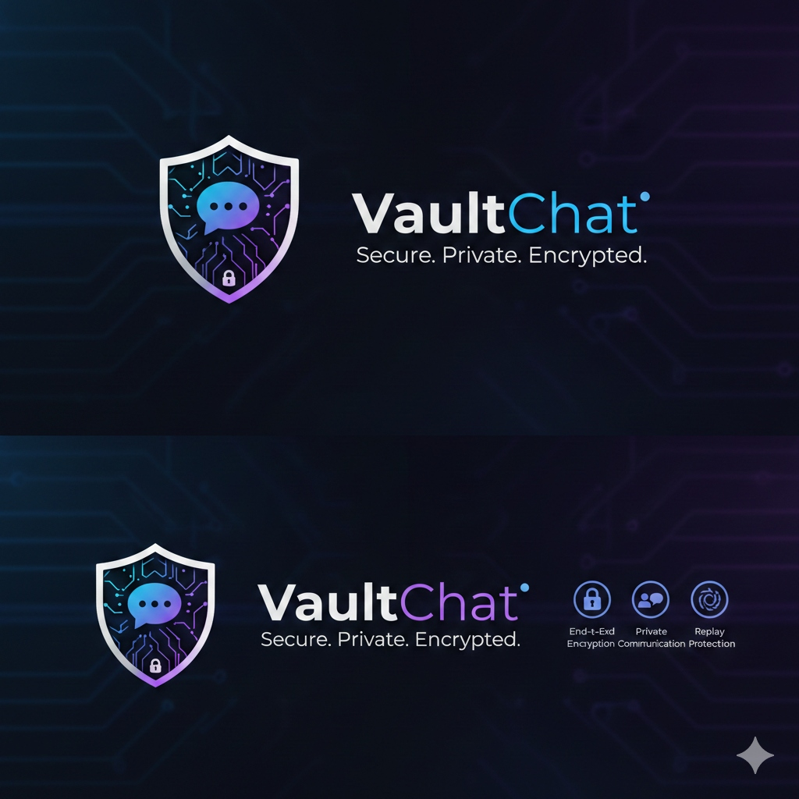

# 🔐 VaultChat

VaultChat is a **zero-knowledge, end-to-end encrypted (E2EE) messaging application** designed for total privacy and metadata security. It ensures that even the server provider has no access to your messages, identity, or activity indicators.

---

## 🚀 Key Features

- **Personal Security Vault**: Local chat history and cryptographic keys are protected by a user-defined passphrase using **PBKDF2-100k** hardening and AES-256 encryption.
- **Identity Protection**: User registration and message retrieval are cryptographically verified using **OpenPGP (RSA 2048)**. No one can hijack your identity without your private key.
- **Full Metadata Encryption**: Not just messages, but also "Protocol Signals" (typing indicators, read receipts, reactions, and WebRTC signaling) are completely encrypted.
- **Ghost Mode (Steganography)**: High-security mode that hides encrypted messages within image pixels using LSB steganography.
- **Self-Healing Stability**: Automated recovery from local data corruption or encryption mismatches.
- **Read-Once Policy**: Messages are automatically purged from the server immediately after successful retrieval.

---

## 🏗️ Architecture

- **Frontend**: Flutter (Web/Mobile) with Riverpod for state management.
- **Backend**: Python FastAPI with PGP signature verification for every sensitive endpoint.
- **Database**: PostgreSQL for message queuing and verified public key storage.
- **Containerization**: Fully Dockerized for easy deployment.

---

## 🛠️ Getting Started

### Prerequisites
- [Docker](https://www.docker.com/get-started)
- [Docker Compose](https://docs.docker.com/compose/install/)

### Installation & Deployment

1. **Clone the repository**:
   ```bash
   git clone <repository-url>
   cd VaultChat
   ```

2. **Launch with Docker Compose**:
   ```bash
   docker-compose up --build
   ```

3. **Access the Application**:
   - Frontend: [http://localhost](http://localhost)
   - Backend API: [http://localhost:8000](http://localhost:8000)

---

## 🔒 Security Specifications

### Encryption Standards
- **Asymmetric**: OpenPGP (RSA 2048-bit)
- **Symmetric (Local)**: AES-256-GCM
- **Key Derivation**: PBKDF2 (HMAC-SHA256, 100,000 iterations)
- **Salting**: Per-device cryptographically secure random salt.

### Identity Management
VaultChat does not use traditional passwords on the server. Instead, it uses **Identity Keys**:
1. Your client generates an OpenPGP KeyPair.
2. The `public_key` is registered on the server.
3. Every subsequent request (fetching messages, changing settings) requires a **Signature** of `(user_id + current_timestamp)`, proving you own the private key.

---

## 🤝 Verification Protocols

To verify the security of your installation:
1. **Try Identity Hijacking**: Attempt to register the same username from a different browser/device. The server will reject it because the signature won't match the registered public key.
2. **Inspect Server Logs**: All "Protocol" events (typing, delivered) will appear as encrypted PGP blobs on the server side.
3. **Audit Local Storage**: Open your browser's IndexedDB; all chat content is stored in an encrypted Hive box that cannot be read without your local Vault Passphrase.

---

## 📜 License
This project is licensed under the MIT License.
